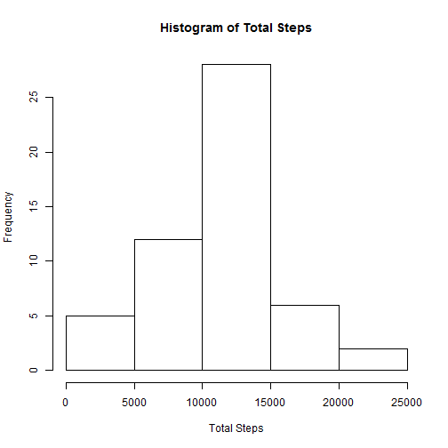
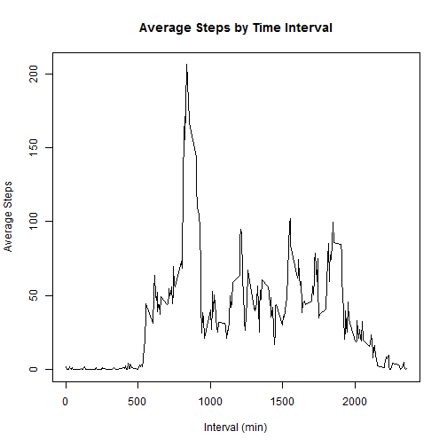
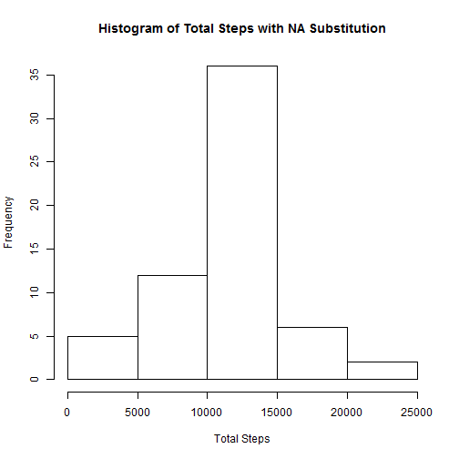
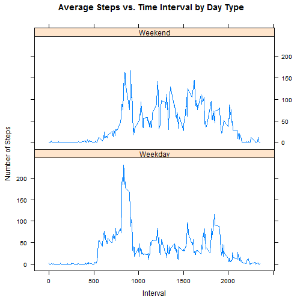

Reproducible Research - Peer Assessment #1
===========================================
##Introduction
The purpose of this assignment is to analyze data from a personal activity monitoring device (e.g. Fitbit). The data set that was provided consists of two months of data from an anonymous individual collected during the months of October and November, 2012 and include the number of steps taken in 5 minute intervals each day. The code that follows answers several questions about the data.

##Loading and preprocessing the data
The following R code reads in the acvitivy data and formats each column.

```r
data <- read.csv("activity/activity.csv", na.strings = NA, colClasses = c("numeric", "character", "numeric"))
data$date <- as.Date(data$date, format="%Y-%m-%d")
```

##Question 1 - What is mean total number of steps taken per day?
The following R code outputs a historgram of the total number of steps per day and computes the mean and median total number of steps taken per day. Missing values are ignored.

```r
# Per the instructions, ignore the NA data
no_na_data <- na.omit(data)

# Calculate and plot the total number of steps
total_steps_by_day <- aggregate(no_na_data$steps, by = list(no_na_data$date), FUN = sum)
names(total_steps_by_day) <- c("Date", "TotalSteps")
hist(total_steps_by_day$TotalSteps, main = "Histogram of Total Steps", xlab = "Total Steps", ylab = "Frequency")
```

 

```r
# Calculate the mean and median number of steps
mean_steps <- mean(total_steps_by_day$TotalSteps)
print(c("Mean steps: ", mean_steps))
```

```
## [1] "Mean steps: "     "10766.1886792453"
```

```r
median_steps <- median(total_steps_by_day$TotalSteps)
print(c("Median steps: ", median_steps))
```

```
## [1] "Median steps: " "10765"
```

##Question 2 - What is the average daily activity pattern?
The following R code calculates the average steps for each time interval and outputs a time series plot of the 5-minute interval and the average number of steps taken, average across all days. 

```r
# Calculate and plot the average steps for each time interval
avg_steps_by_int <- aggregate(no_na_data$steps, by = list(no_na_data$interval), FUN = mean)
names(avg_steps_by_int) <- c("Interval", "AverageSteps")
plot(avg_steps_by_int$Interval, avg_steps_by_int$AverageSteps, type = "l", main = "Average Steps by Time Interval", xlab = "Interval (min)", ylab = "Average Steps")
```

 

```r
# Report the time interval with the maximum average steps
max_row <- order(avg_steps_by_int$AverageSteps, decreasing = TRUE)[1]
max_int <- avg_steps_by_int[max_row, 1]
print(c("Time interval with maximum average steps: ", max_int))
```

```
## [1] "Time interval with maximum average steps: "
## [2] "835"
```

##Imputing Missing Values
The following R code imputes any missing values from the data by substituting the average steps for the time interval across all days.

```r
# Calculate the number of missing values
missing_vector <- !complete.cases(data)
print(c("Number of missing values in the dataset", sum(missing_vector)))
```

```
## [1] "Number of missing values in the dataset"
## [2] "2304"
```

```r
# Use the average steps by time interval data as a substitute for missing values

# Merge the activity data with the average steps by time interval
mrg_avg_steps_by_int <- merge(data, avg_steps_by_int, by.x = "interval", by.y = "Interval")

# Loop through merged data set and replace NA values with the average for that time interval
for(i in seq_along(mrg_avg_steps_by_int$steps)) {
    if(is.na(mrg_avg_steps_by_int[i,2])) {
        mrg_avg_steps_by_int[i,2] <- mrg_avg_steps_by_int[i,4]
    }
}

# Remove the column that was added during the merge, return the substituted dataset
sub_activity_data <- mrg_avg_steps_by_int[,1:3]

# Calculate and plot the total number of steps
sub_total_steps_by_day <- aggregate(sub_activity_data$steps, by = list(sub_activity_data$date), FUN = sum)
names(sub_total_steps_by_day) <- c("Date", "TotalSteps")
hist(sub_total_steps_by_day$TotalSteps, main = "Histogram of Total Steps with NA Substitution", xlab = "Total Steps", ylab = "Frequency")
```

 

```r
# Calculate the mean and median number of steps
sub_mean_steps <- mean(sub_total_steps_by_day$TotalSteps)
print(c("Mean steps: ", sub_mean_steps))
```

```
## [1] "Mean steps: "     "10766.1886792453"
```

```r
sub_median_steps <- median(sub_total_steps_by_day$TotalSteps)
print(c("Median steps: ", sub_median_steps))
```

```
## [1] "Median steps: "   "10766.1886792453"
```
The mean value for total number of steps taken per day is identical in this part of the assignment compared to the first part. The median value for total number of steps taken per day is slightly higher in this part compared to the first part. The mean and median values are now identical.

##Question 3 - Are there differences in activity patterns between weekdays and weekends?
The following R code assesses whether there are any differences in the acitivity patterns between weekdays and weekends by making a panel plot of hte 5-minute interval and average number of steps taken, averaged across all weekday days or weekend days. The charts show that the individual is generally more active throughout the day on the weekend, but has a higher peak number of steps on weekdays.

```r
# create a factor variable for weekday or weekend
sub_factor_data <- cbind(sub_activity_data, weekdays(sub_activity_data$date))
names(sub_factor_data) <- c("interval", "steps", "date", "day")
sub_factor_data$day <- sub("Monday|Tuesday|Wednesday|Thursday|Friday", "Weekday", sub_factor_data$day)
sub_factor_data$day <- sub("Saturday|Sunday", "Weekend", sub_factor_data$day)
sub_factor_data$day <- factor(sub_factor_data$day)

# Create a panel plot with a time series of 5 minute intervals on x axis and average number of steps, averaged across weekdays and weekends
avg_steps_by_int_day <- aggregate(sub_factor_data$steps, by = list(sub_factor_data$interval, sub_factor_data$day), FUN = mean)
names(avg_steps_by_int_day) <- c("Interval", "Day", "AverageSteps")

library(lattice)
print(xyplot(avg_steps_by_int_day$AverageSteps ~ avg_steps_by_int_day$Interval | avg_steps_by_int_day$Day, type = "l", layout = c(1,2), xlab = "Interval", ylab = "Number of Steps", main = "Average Steps vs. Time Interval by Day Type"))
```

 
